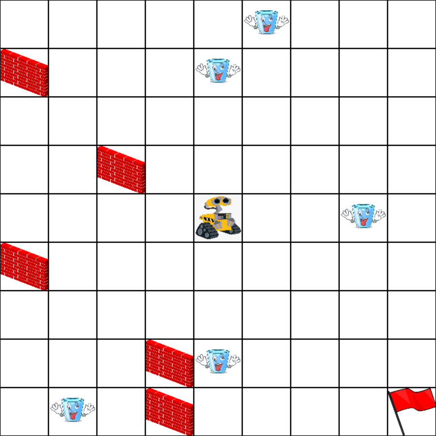
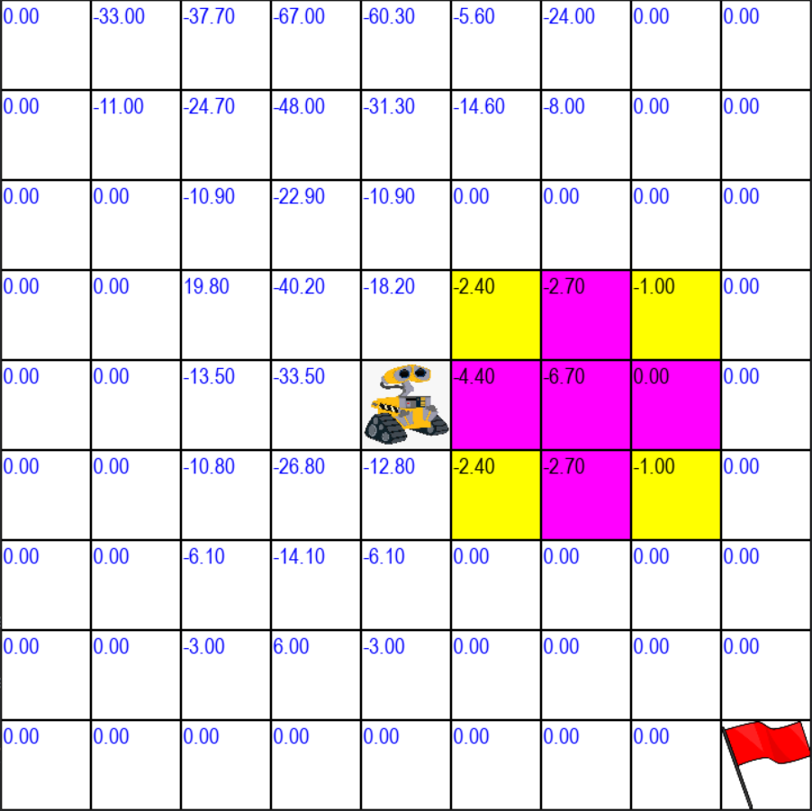

# Simulation of AMR
## Summary
This is a simulation game for using tof+sonar to avoid barries
There are some transparent andn non-transparent barries in the map.
The robot can get some number to indicate if there is anything in the block.
The play need to contol the view of the robot, control it to the goal.

An example of the environment, and the view of the robot




## Target & Rule
Goal : Move the bot to the flag block.

Fail : Move to the block with any barries.

## Runtime Environment
Python3.x with numpy and pygame is required. (pygame is not available now for python above 3.10)<br>

1. Download the code to <sim_path>
2. Open terminal and change to the current path to <sim_path>
```
cd <sim_path>
```
3. Install the required packages in the terminal.
```
pip install numpy pygame
```
4. Run the script. \<Username> is optional.

```
python main.py <Username>
```


## Control
|key| action|
|----|-----|
|a| look left|
|w| look up|
|s| look down|
|d| look right|
|left| move to left block|
|right| move to right block|
|up| move to block up|
|down| move to down block down |
| r | restart game |
| 0| only tof|
| 1| tof + sonar|
|q | quit |

# record.log
* Check the results

|name| mode|move|view|goal|fail|
|----|-----|----|----|-----|-----|
|player name| 0: only tof <br> 1:tof+sonar| move num. | view num. | goal num. +1 | fail num. +1 |